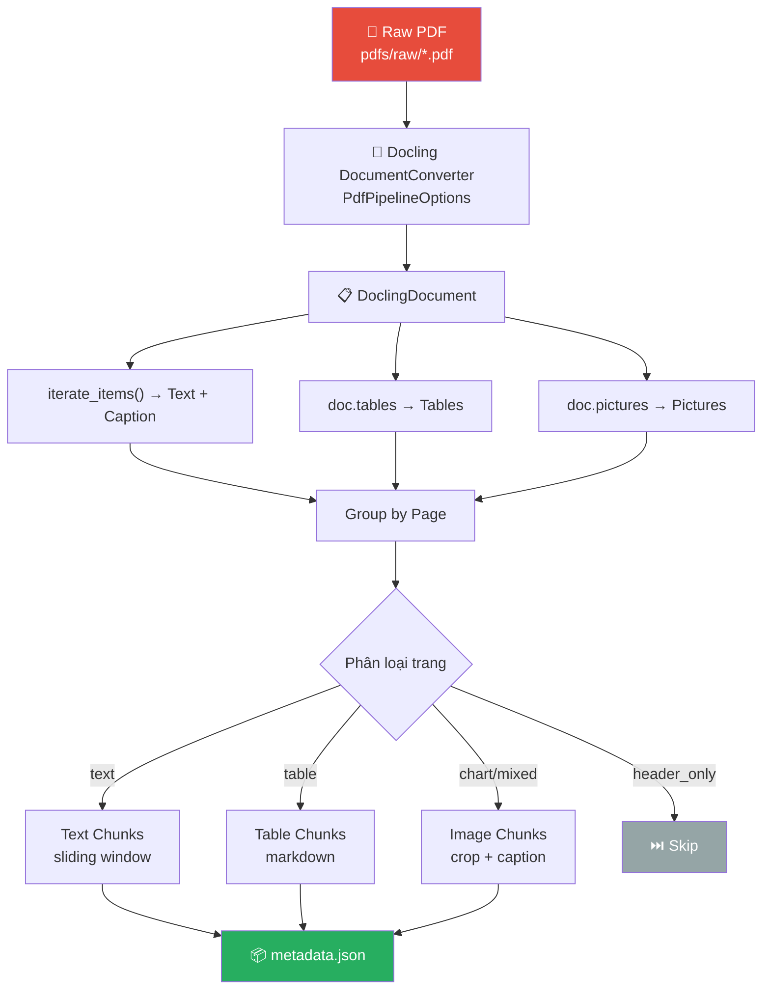
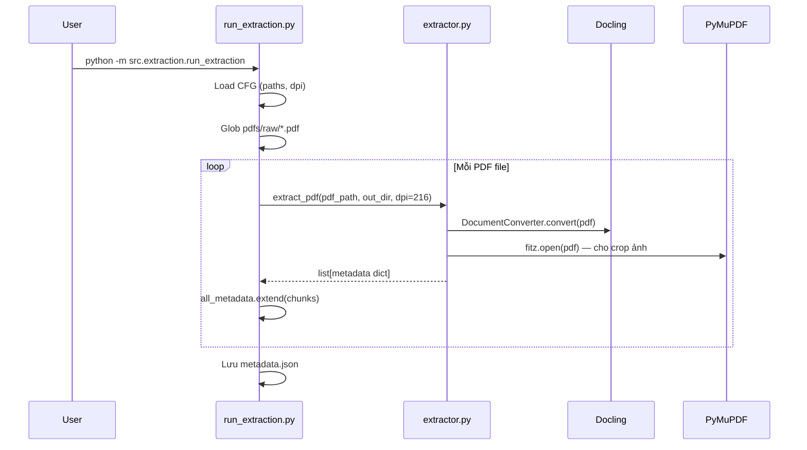
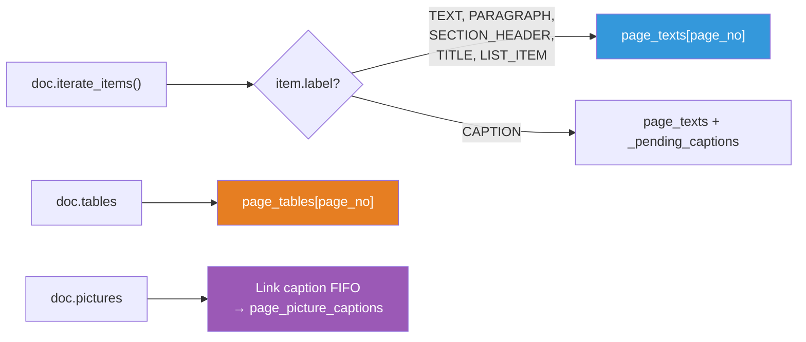
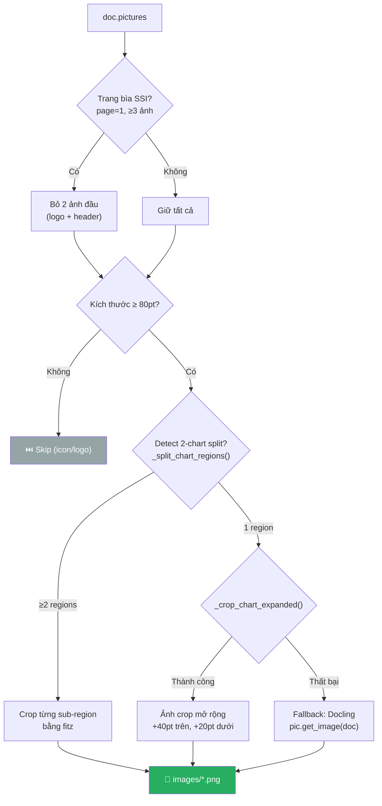
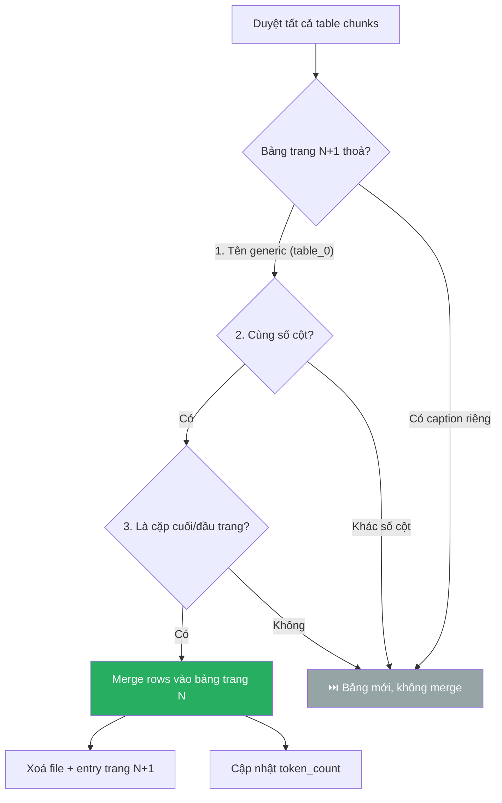
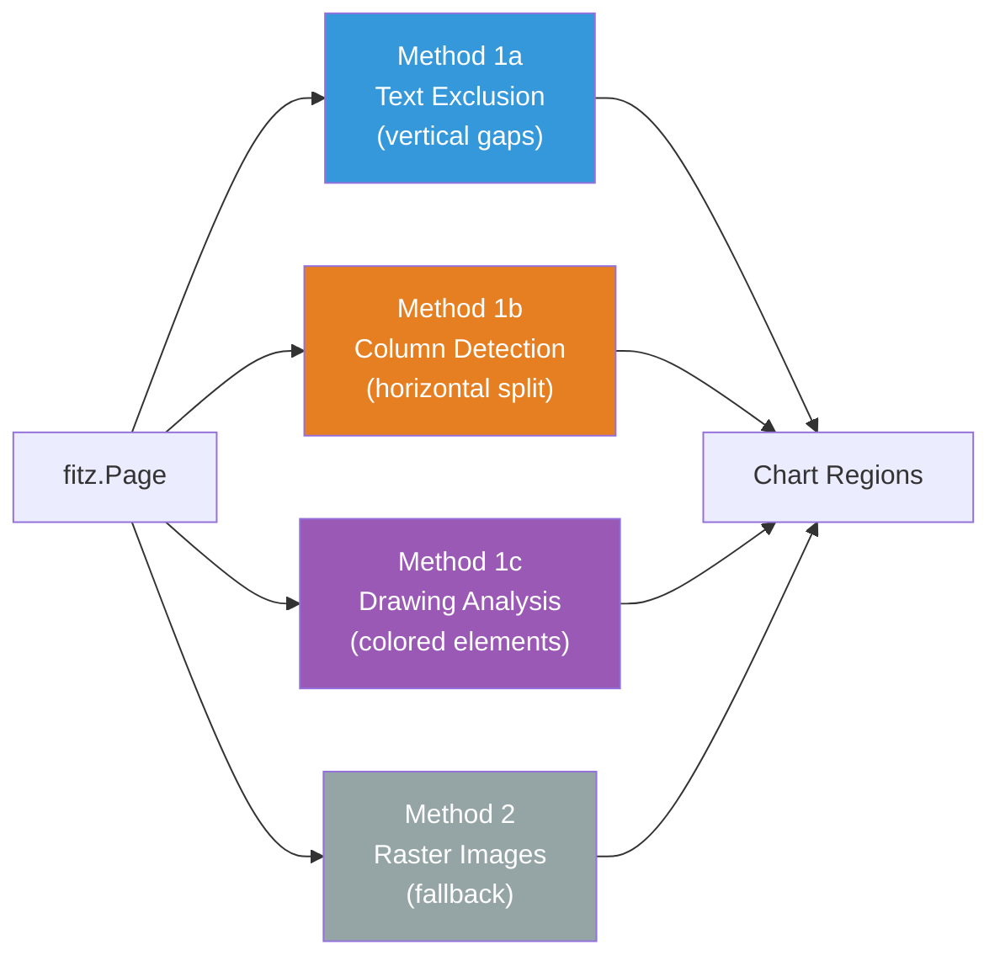
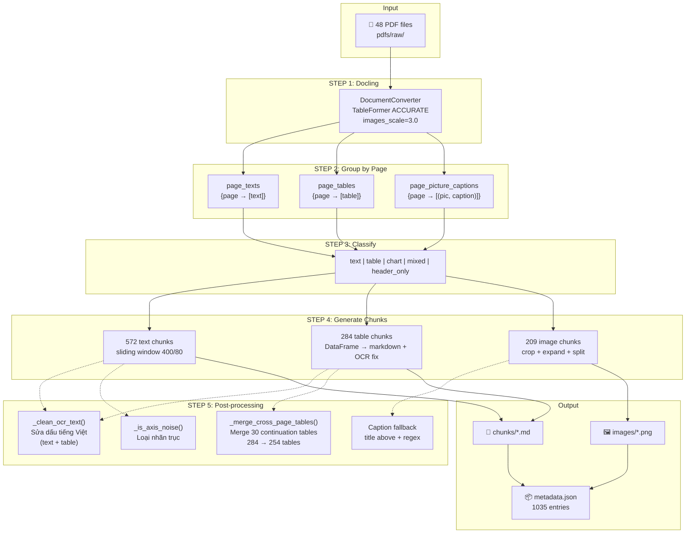

# Phân tích luồng Extract tài liệu Raw PDF

> Hệ thống Multimodal RAG — Báo cáo tài chính Việt Nam (SSI Research)

---

## 1. Tổng quan kiến trúc Extraction



### Các file liên quan

| File | Vai trò |
|------|---------|
| [extractor.py](file:///Users/buihung/RAG/ĐATN/source_code_2/src/extraction/extractor.py) | Pipeline chính: `extract_pdf()` + tất cả helper functions |
| [figure_extractor.py](file:///Users/buihung/RAG/ĐATN/source_code_2/src/extraction/figure_extractor.py) | Detect vùng biểu đồ bằng 3 phương pháp (text exclusion, columns, drawings) |
| [run_extraction.py](file:///Users/buihung/RAG/ĐATN/source_code_2/src/extraction/run_extraction.py) | Entry point: loop qua tất cả PDF → gọi `extract_pdf()` → lưu `metadata.json` |
| [config.yaml](file:///Users/buihung/RAG/ĐATN/source_code_2/config/config.yaml) | Cấu hình DPI, paths |

### Thống kê thực tế (48 PDFs đã xử lý)

| Metric | Giá trị |
|--------|---------|
| Tổng chunks | **1035** |
| Text chunks | 572 (55%) |
| Table chunks | 254 (25%) |
| Image chunks | 209 (20%) |
| Unique documents | 48 |
| Page types | mixed: 399, table: 274, chart: 209, text: 153 |
| Cross-page tables merged | 30 continuation tables |

---

## 2. Entry Point — `run_extraction.py`



**Luồng đơn giản:**
1. Đọc config → lấy `pdf_raw`, `pdf_processed`, `dpi`
2. Glob tất cả `*.pdf` trong `pdfs/raw/`
3. Với mỗi PDF → gọi `extract_pdf()` → nhận list metadata dicts
4. Gộp tất cả → ghi ra `pdfs/processed/metadata.json`

---

## 3. Pipeline chính — `extract_pdf()`

Hàm [extract_pdf()](file:///Users/buihung/RAG/ĐATN/source_code_2/src/extraction/extractor.py#L50) gồm **5 bước chính**:

### STEP 1 — Docling Conversion (Line 77-96)

```python
pipeline_options = PdfPipelineOptions()
pipeline_options.do_table_structure = True
pipeline_options.table_structure_options.mode = TableFormerMode.ACCURATE
pipeline_options.generate_picture_images = True
pipeline_options.images_scale = images_dpi / 72.0   # 216/72 = 3.0

converter = DocumentConverter(
    format_options={InputFormat.PDF: PdfFormatOption(pipeline_options=pipeline_options)}
)
result = converter.convert(pdf_path)
doc = result.document
```

| Option | Giá trị | Ý nghĩa |
|--------|---------|---------|
| `do_table_structure` | `True` | Bật nhận dạng cấu trúc bảng |
| `table_structure_options.mode` | `ACCURATE` | Dùng TableFormer mode chính xác (chậm hơn nhưng đúng hơn) |
| `generate_picture_images` | `True` | Docling tự crop ảnh từ PDF |
| `images_scale` | `3.0` (= 216/72) | Độ phân giải ảnh = 3× so với gốc PDF |

> [!NOTE]
> Song song với Docling, hệ thống mở PDF bằng **PyMuPDF (fitz)** để: crop ảnh mở rộng, detect 2-chart split, tìm title phía trên ảnh.

### STEP 2 — Group Items by Page (Line 100-197)

Docling trả về `DoclingDocument` — hệ thống duyệt **một lần duy nhất** qua `doc.iterate_items()` để phân loại:



**Chi tiết xử lý text items:**
- Labels được thu thập: `TEXT`, `SECTION_HEADER`, `LIST_ITEM`, `CAPTION`, `PARAGRAPH`, `TITLE`
- `SECTION_HEADER` → prefix `## `
- `TITLE` → prefix `# `
- Lọc axis noise: `_is_axis_noise()` loại nhãn trục biểu đồ bị OCR rò rỉ
- Strip axis prefix: `_strip_axis_prefix()` cắt bỏ phần "HS 400 25% 30%" đứng đầu text thật
- Clean OCR: `_clean_ocr_text()` sửa lỗi tách dấu tiếng Việt

**Link Caption → Picture (FIFO):**

Docling output captions **TRƯỚC** pictures → hệ thống dùng hàng đợi `_pending_captions[page_no]` theo thứ tự FIFO. Nếu caption chỉ là source note ("Nguồn: SSI Research"), kích hoạt **2 fallback**:

| Fallback | Phương pháp | Ví dụ |
|----------|-------------|-------|
| **A** | Tìm text block phía trên bbox ảnh bằng fitz (`_find_title_above_pic`) | "Giá than nhập khẩu bình quân..." |
| **B** | Regex keyword trong `page_texts` (`biểu đồ`, `đồ thị`, `chart`, `figure`) | "Biểu đồ 5: Lợi suất tài sản" |
| **Default** | `f"Biểu đồ trang {page_no}"` | "Biểu đồ trang 3" |

### STEP 3 — Phân loại trang (Line 200-241)

```python
if has_table and has_chart:      page_type = "mixed"
elif has_table:                   page_type = "table"
elif has_chart and not has_text:  page_type = "chart"
elif has_chart:                   page_type = "mixed"
elif has_text:
    if len(total_text.split()) < 20:
        page_type = "header_only"  # → SKIP
    else:
        page_type = "text"
else:
    page_type = "header_only"      # → SKIP
```

| Page Type | Điều kiện | Hành động |
|-----------|-----------|-----------|
| `text` | Chỉ có text ≥20 words | Tạo text chunks |
| `table` | Có bảng, không có chart | Tạo text + table chunks |
| `chart` | Chỉ có chart, không có text | Tạo image chunks |
| `mixed` | Có bảng+chart hoặc text+chart | Tạo cả 3 loại chunks |
| `header_only` | Text <20 words, không có gì khác | **Bỏ qua trang** |

### STEP 4 — Tạo Chunks (Line 244-443)

#### 4a. Text Chunks — Sliding Window

```
Full page text → sliding_window_chunk(text, size=400, overlap=80) → N chunks
```

- **Chunk size**: 400 tokens (xấp xỉ bằng từ, `text.split()`)
- **Overlap**: 80 tokens giữa các chunk liên tiếp
- **Metadata header** chèn vào mỗi chunk:
  ```html
  <!-- document: VNM_2026_02_24_SSIResearch | page: 5 | topic: Biên lợi nhuận gộp -->
  ```
- **Topic extraction** (`_extract_topic`): ưu tiên `SECTION_HEADER` → `TITLE` → đoạn text dài đầu tiên
- Output: `chunks/{chunk_id}_text.md`

#### 4b. Table Chunks — Markdown Export

```python
df = table.export_to_dataframe(doc)
table_md = df.to_markdown(index=False)
table_md = _clean_ocr_text(table_md)   # Sửa lỗi tách dấu tiếng Việt trong bảng
```

- Mỗi bảng = **1 chunk riêng** (không sliding window)
- **OCR fix cho bảng**: `_clean_ocr_text()` được áp dụng cho nội dung bảng (trước đây chỉ áp dụng cho text chunks, bỏ sót 52% bảng có lỗi)
- Table name: slug lowercase từ caption, tối đa 50 ký tự
- Table caption detection: `_find_table_captions()` tìm pattern `"Bảng N:"` trong text
- Output: `chunks/{chunk_id}_table{idx}.md`

#### 4c. Image Chunks — Crop & Save



**Chiến lược crop mở rộng** (`_crop_chart_expanded`):

| Padding | Giá trị | Lý do |
|---------|---------|-------|
| `pad_above` | 40pt | Bắt caption/title nằm phía trên biểu đồ |
| `pad_below` | 20pt | Bắt dòng "Nguồn: SSI Research" phía dưới |
| `pad_side` | 10pt | Tránh cắt sát mép biểu đồ |

**Chuyển đổi hệ toạ độ:**
- Docling: origin = **bottom-left** (gốc góc dưới-trái)
- fitz (PyMuPDF): origin = **top-left** (gốc góc trên-trái)
- Công thức: `fitz_top = page_height - docling_bbox.t`

**Detect 2-chart split** (`_split_chart_regions`): Khi Docling gộp 2 biểu đồ thành 1 picture item:
1. Lấy text blocks bên trong vùng ảnh bằng fitz
2. Gom thành text bands
3. Tìm gap dọc ≥ 70pt → ranh giới giữa 2 biểu đồ
4. Crop riêng từng sub-region

### STEP 5 — Post-processing: Merge bảng cross-page (Line 448)

Sau khi tạo xong tất cả chunks, hàm [`_merge_cross_page_tables()`](file:///Users/buihung/RAG/ĐATN/source_code_2/src/extraction/extractor.py#L890) merge bảng continuation nằm trên 2 trang liên tiếp.



**5 điều kiện merge** (tất cả phải thoả):

| # | Điều kiện | Lý do |
|---|-----------|-------|
| 1 | Trang liên tiếp (N, N+1) | Chỉ merge bảng kề nhau |
| 2 | Bảng sau có tên generic (`table_0`) | Bảng có caption riêng = bảng mới |
| 3 | Cùng số cột | Khác cột = khác bảng |
| 4 | Bảng trước là cuối trang | Tránh merge nhầm bảng giữa trang |
| 5 | Bảng sau là đầu trang | Tương tự |

**Xử lý separator row**: Docling `to_markdown()` luôn tạo separator `---|---` kể cả cho continuation table (dùng data row đầu làm pseudo-header). Hàm merge nhận diện và strip separator, giữ lại data rows.

**Kết quả**: Merge 30 continuation tables, giảm từ 284 → 254 table chunks.

> [!TIP]
> Ví dụ: GAS Bảng 7 "Các dự án chính 2026-2030" trải 2 trang → sau merge: 1 chunk duy nhất với 8 dự án đầy đủ (trước: 6 dự án trang 4 + 2 dự án orphan trang 5).

---

## 4. Xử lý đặc thù tiếng Việt

### 4.1. `_clean_ocr_text()` — Sửa lỗi Docling tách dấu

Docling thường xuyên tách âm tiết tiếng Việt thành mảnh. Hàm này chạy **3 pass × 2 lần lặp**:

| Pass | Pattern | Ví dụ |
|------|---------|-------|
| A | `non-space + space + Vietnamese_char ở cuối token` | "v ề" → "về", "KH Ả" → "KHẢ" |
| B | `Vietnamese_char + space + phụ âm cuối` | "Lợ i" → "Lợi", "lượ ng" → "lượng" |
| C | `ASCII prefix + space + Vietnamese vowel-diacritic` | "Bi ểu" → "Biểu" |

> [!IMPORTANT]
> Regex chỉ fire khi ký tự theo sau nằm ở **cuối token** (trước space/punct/EOL), tránh merge nhầm 2 từ riêng biệt.

### 4.2. `_is_axis_noise()` — Loại nhãn trục

Phát hiện text bị OCR từ axis ticks biểu đồ:

| Case | Điều kiện | Ví dụ |
|------|-----------|-------|
| 1 | 1-2 ký tự hoa (không có Vietnamese) | "HS", "Q", "IV" |
| 2 | Tất cả tokens đều là số/% | "25%", "80,0% 70,0%" |
| 3 | ≥3 tokens số, chiếm >50% tổng tokens | "HS 400 25% 30% 20% 10%" |

### 4.3. `_strip_axis_prefix()` — Cắt prefix nhiễu

Khi Docling gộp axis ticks với đoạn văn thật:
```
"HS 400 25% 30% 60,0% tính từ đầu năm. Ở chiều ngược lại..."
→ "tính từ đầu năm. Ở chiều ngược lại..."
```
Điều kiện: prefix >5 ký tự, chứa số/%, tỷ lệ noise >60%.

---

## 5. Module `figure_extractor.py` — Detect vùng biểu đồ

> [!NOTE]
> Module này cung cấp các hàm detect vùng chart bổ sung. Trong pipeline hiện tại, `extractor.py` chủ yếu dùng `_split_chart_regions()` + `_crop_chart_expanded()` riêng, nhưng `figure_extractor.py` cung cấp API `get_chart_rects()` và `extract_figures_from_page()` cho use case khác.

### 3 phương pháp detect



| # | Phương pháp | Nguyên lý | Phù hợp với |
|---|-------------|-----------|-------------|
| 1a | **Text Exclusion** | Gom text blocks → tìm gap dọc ≥60pt | Layout: text trên/dưới, chart giữa |
| 1b | **Column Detection** | ≥65% text blocks lệch 1 bên → bên kia là chart | Layout 2 cột (text trái, chart phải) |
| 1c | **Drawing Analysis** | Lọc drawing elements có fill/stroke màu (loại viền bảng đen/xám) → cluster 2D | Vector graphics charts |
| 2 | **Raster Fallback** | `get_images()` → lọc kích thước ≥100×100pt | PDF nhúng chart dạng PNG/JPEG |

---

## 6. Cấu trúc Output

### 6.1. Thư mục output

```
pdfs/processed/
├── chunks/                          # Text + Table chunks
│   ├── VNM_..._p004_c00_text.md     # Text chunk (markdown + metadata header)
│   ├── VNM_..._p004_c01_text.md
│   ├── VNM_..._p004_table00.md      # Table chunk (markdown table)
│   └── ...
├── images/                          # Image chunks
│   ├── VNM_..._p002_chart00.png     # Single chart
│   ├── VNM_..._p003_chart00_00.png  # Split chart (part 1)
│   ├── VNM_..._p003_chart00_01.png  # Split chart (part 2)
│   └── ...
└── metadata.json                    # 1035 entries
```

### 6.2. Schema metadata entry

| Field | Type | Text | Table | Image |
|-------|------|------|-------|-------|
| `chunk_id` | string | `{doc}_p{page}_c{idx}` | `{doc}_p{page}_table{idx}` | `{doc}_p{page}_chart{idx}` |
| `chunk_type` | string | `"text"` | `"table"` | `"image"` |
| `doc` | string | ✅ | ✅ | ✅ |
| `page` | int | ✅ | ✅ | ✅ |
| `page_type` | string | ✅ | ✅ | `"chart"` |
| `text_path` | string | path `.md` | path `.md` | `null` |
| `img_path` | string | `null` | `null` | path `.png` |
| `content_for_embedding` | string | = `text_path` | = `text_path` | = `img_path` |
| `ticker` | string | ✅ | ✅ | ✅ |
| `report_date` | string | ✅ | ✅ | ✅ |
| `source` | string | ✅ | ✅ | ✅ |
| `caption` | string | ✗ | ✗ | ✅ |
| `table_name` | string | ✗ | ✅ | ✗ |
| `token_count` | int | >0 | >0 | `0` |

### 6.3. Naming Convention cho PDF

Format: `TICKER_YYYY_MM_DD_SOURCE.pdf`

Ví dụ: `VNM_2026_02_24_SSIResearch.pdf` → parse bởi `_parse_doc_name()`:
- `ticker` = "VNM"
- `report_date` = "2026-02-24"
- `source` = "SSIResearch"

---

## 7. Sơ đồ luồng End-to-End



---

## 8. Các hằng số quan trọng

| Hằng số | Giá trị | Định nghĩa tại | Ý nghĩa |
|---------|---------|-----------------|---------|
| `CHUNK_SIZE` | 400 | extractor.py:41 | Số tokens tối đa mỗi text chunk |
| `CHUNK_OVERLAP` | 80 | extractor.py:42 | Tokens overlap giữa chunks |
| `MIN_CHART_SIZE_PT` | 80 | extractor.py:43 | Kích thước tối thiểu (pt) để coi là biểu đồ |
| `images_dpi` | 216 | config.yaml:11 | DPI render ảnh (scale = 3.0×) |
| `pad_above` | 40pt | extractor.py:535 | Mở rộng phía trên biểu đồ |
| `pad_below` | 20pt | extractor.py:536 | Mở rộng phía dưới biểu đồ |
| `min_sub_height` | 70pt | extractor.py:688 | Chiều cao tối thiểu sub-region khi split chart |

---

## 9. Điểm đáng chú ý & Edge Cases

> [!WARNING]
> **SSI Cover Page**: Trang bìa SSI Research luôn tạo 3 ảnh (logo, header, chart giá CP). Hệ thống tự bỏ 2 ảnh đầu, chỉ giữ chart giá cổ phiếu (index ≥2).

> [!IMPORTANT]
> **Coordinate System Mismatch**: Docling dùng bottom-left origin, fitz dùng top-left origin. Mọi thao tác crop đều phải convert: `fitz_y = page_height - docling_y`.

> [!TIP]
> **Caption Quality**: Caption tốt là yếu tố quyết định cho image retrieval (vì embedding dùng α=0.8 cho caption). Fallback chain (FIFO → title above → regex → default) đảm bảo mọi ảnh đều có caption.

### Dependency chain tiếp theo

```
extract_pdf() → metadata.json → run_embedding.py → ChromaDB (rag_text + rag_image)
```

Metadata output là **đầu vào trực tiếp** cho Pipeline 2 (Embedding). Field `content_for_embedding` chỉ đến file cần embed:
- Text/Table: đọc `.md` file → embed text bằng Gemini Embedding 2
- Image: đọc `.png` file → caption bằng Gemini Vision → blend α=0.8 caption + image vector
